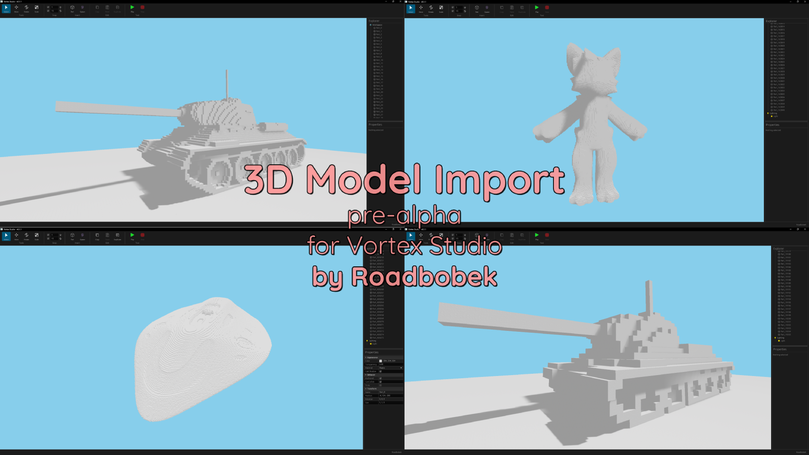

# Vortex Studio 3D Model Importer

### Import .obj 3d models into Vortex Studio.

**Current Features:**
- Import .obj 3d models.
- Variable quality setting.

**Planned Features:**
- Greedy meshing optimisation.
- MTL colour extraction.

**_Version: 1.0.0_**

_For Vortex Studio v0.1.1_

